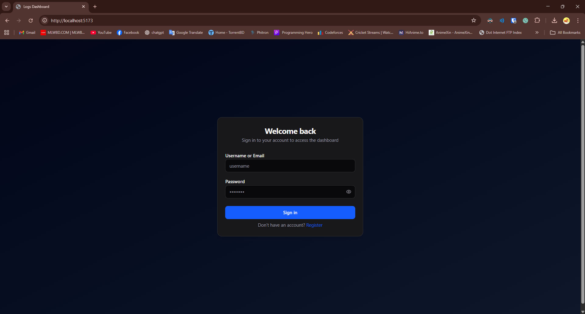
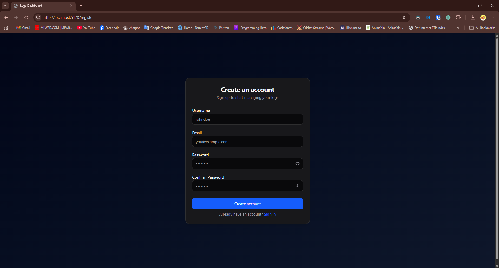
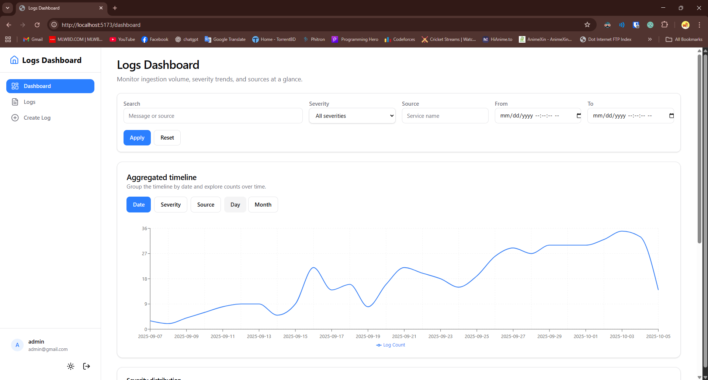
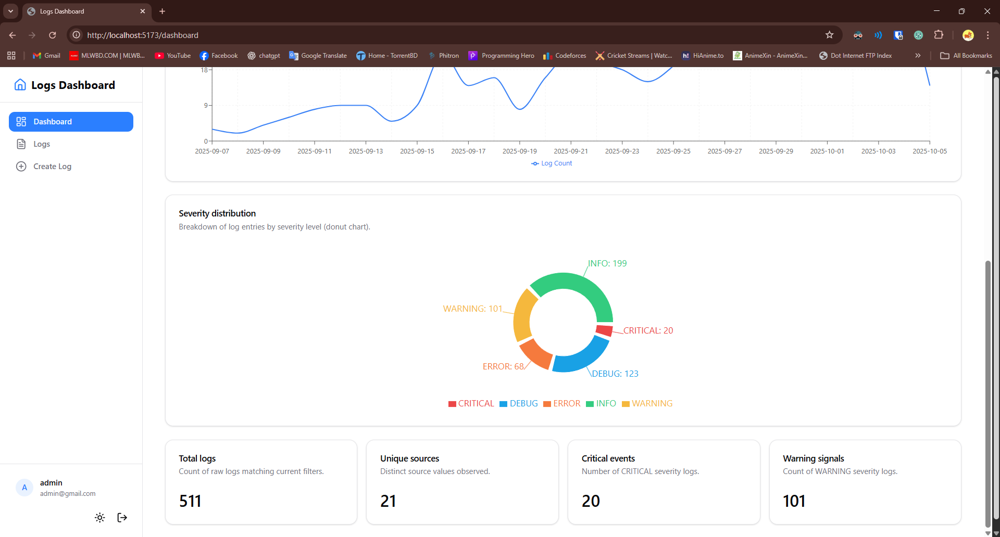
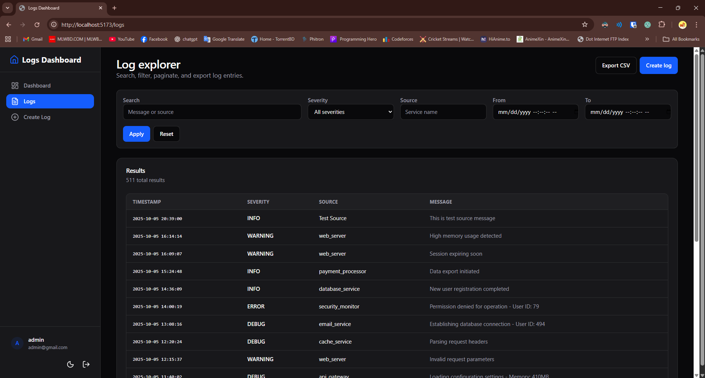
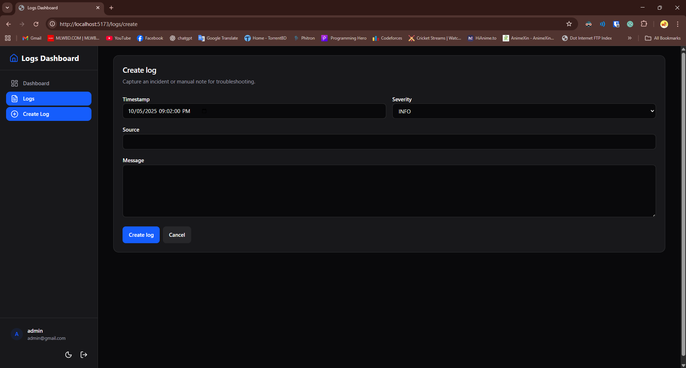
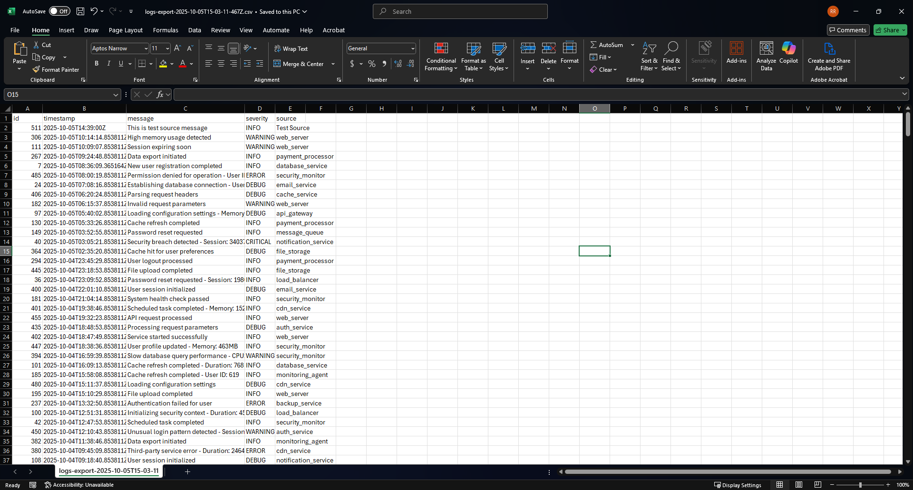

# 📊 Logs Dashboard

A modern, full-stack log management dashboard built with React 19 + Django 5, featuring real-time WebSocket updates, JWT authentication, and comprehensive filtering capabilities.

## 🚀 Tech Stack

### Frontend

- **React 19** with TypeScript 5.5.4
- **Vite 5** for lightning-fast development
- **Tailwind CSS v4** with dark mode support
- **shadcn/ui** components for modern UI
- **React Router 7** for navigation
- **Axios** with JWT interceptors
- **Recharts** for data visualization
- **Sonner** for toast notifications

### Backend

- **Django 5.2** with Django REST Framework
- **MySQL** database with optimized indexing
- **Redis** for WebSocket channel layers
- **Django Channels** for real-time updates
- **JWT Authentication** with token refresh
- **CSV Export** with streaming support

## 📸 Application Screenshots

exported csv file

### Detailed Setup Guides

- **[Frontend Setup](./frontend/README.md)** - Complete Vite + React development guide
- **[Backend Setup](./backend/README.md)** - Django + DRF configuration and API docs
